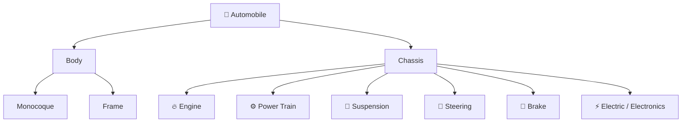
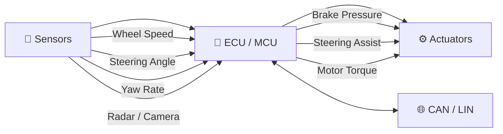
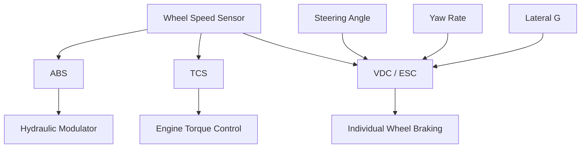
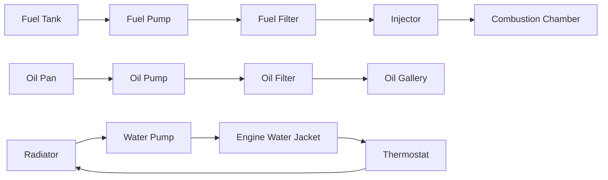
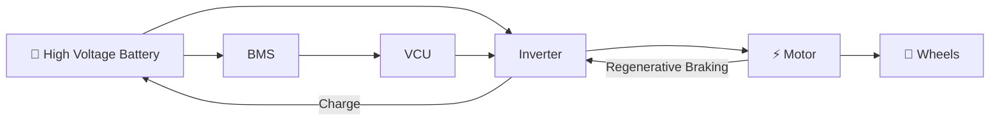
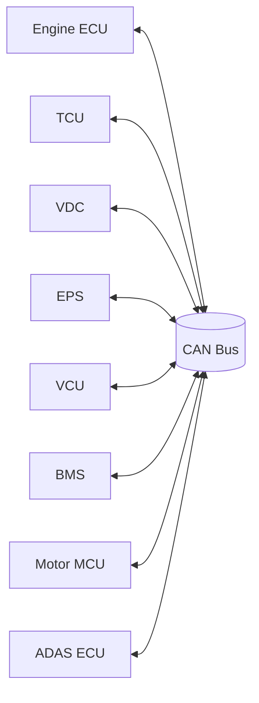
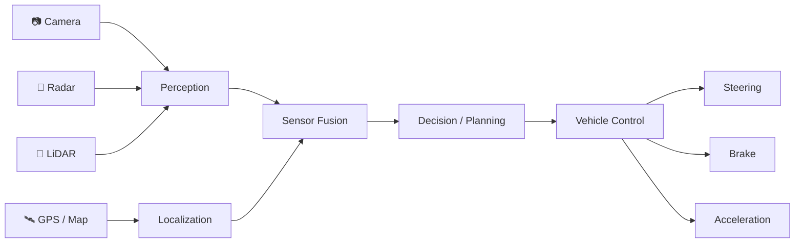
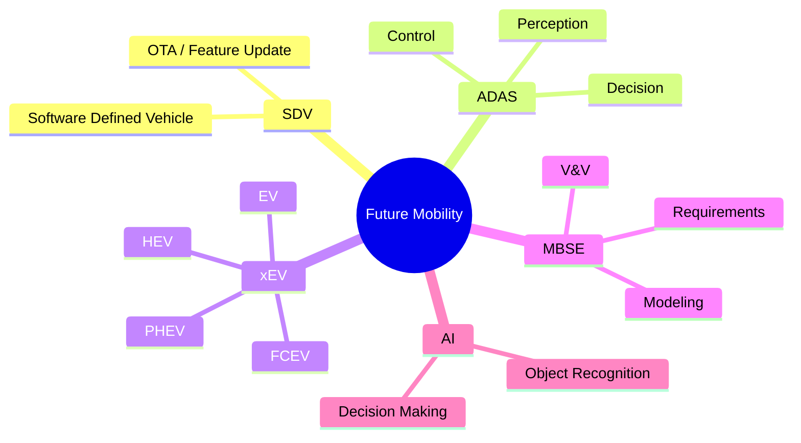

# 🚗 Automotive Engineering · Visual Overview

<p align="center">
  
</p>

<p align="center">
  
  
  
  
</p>

---

## 🧭 전체 학습 지도


> 기계 구조부터 시작해서 전자제어, 차량 네트워크, 전동화, 자율주행으로 확장되는 흐름으로 보면 전체 강의가 훨씬 덜 산만하다.

---

## 🧱 자동차 시스템 큰 그림



---

## 🧠 전자제어의 핵심



| 계층 | 역할 | 대표 예시 |
|---|---|---|
| 📡 **Sensor** | 차량 상태 측정 | Wheel Speed, Steering Angle, Yaw Rate, Radar, Camera |
| 🧠 **ECU / MCU** | 상태 판단 및 제어 연산 | ABS ECU, Engine ECU, VCU, BMS |
| 🌐 **Network** | ECU 간 정보 교환 | CAN, LIN, V2X |
| ⚙️ **Actuator** | 물리적 동작 수행 | Brake, EPS Motor, Throttle, Inverter |

---

## 🛞 샤시 전자제어 한눈에 보기



### 시스템별 핵심

| 시스템 | 무엇을 막는가 / 돕는가 | 핵심 입력 | 핵심 출력 |
|---|---|---|---|
| 🛑 **ABS** | 제동 시 바퀴 잠김 방지 | Wheel Speed | Brake Hydraulic Pressure |
| 🏁 **TCS** | 구동륜 과도한 슬립 방지 | Wheel Speed, Throttle | Engine Torque / Brake |
| 🧭 **VDC / ESC** | 스핀·오버스티어 등 자세 불안정 억제 | Steering, Yaw, Lateral G | Individual Wheel Brake |
| 🎯 **EPS** | 조향 보조 | Vehicle Speed, Steering Input | Assist Motor Torque |
| 🔄 **AFS** | 상황별 조향기어비 제어 | Speed, Steering, Yaw | Steering Actuator |

---

## 🔥 내연기관 시스템 흐름



### 4행정 사이클


---

## ⚡ 전기자동차 구조



### EV 핵심 모듈

| 모듈 | 역할 |
|---|---|
| 🔋 **BMS** | 셀 전압·온도·SOC 감시 및 배터리 보호 |
| 🧠 **VCU** | 차량 전체의 구동 요구와 에너지 흐름 관리 |
| ⚡ **Inverter / MCU** | DC를 모터 구동용 AC로 변환하고 토크 제어 |
| 🔌 **OBC / LDC** | 충전 및 고전압/저전압 전력변환 |
| ♻️ **Regenerative Braking** | 감속 에너지를 전기에너지로 회수 |

---

## 🌐 차량 네트워크



> 자동차는 ECU 하나로 돌아가는 기계가 아니라, 여러 제어기가 네트워크로 협조하는 **분산 실시간 시스템**으로 보는 것이 핵심이다.

---

## 🤖 ADAS / 자율주행 파이프라인



### 대표 ADAS

| 기능 | 핵심 역할 |
|---|---|
| 🚘 **ASCC** | 선행차 거리·속도 기반 자동 속도/차간거리 유지 |
| ⚠️ **LDWS** | 차선 이탈 경고 |
| 🛣️ **LKAS** | EPS와 연계한 능동 차선 유지 |
| 🛑 **AEB / AEBS** | 충돌 위험 시 자동 제동 |
| 👁️ **BSD / LCA** | 사각지대 및 차선변경 위험 경고 |
| 🅿️ **PGS** | 주차 보조 |

---

## 🚀 미래자동차 키워드



---

## 💻 임베디드 SW 개발자 관점

```text
┌──────────────────────────────┐
│        Mechanical Plant      │
└──────────────┬───────────────┘
               │ physical state
               ▼
┌──────────────────────────────┐
│ Sensors / ADC / SPI / I2C    │
└──────────────┬───────────────┘
               ▼
┌──────────────────────────────┐
│ MCU / ECU Firmware           │
│ RTOS · ISR · State Machine   │
└──────────────┬───────────────┘
               ▼
┌──────────────────────────────┐
│ Control Algorithm            │
│ Diagnostics · Fail-safe      │
└──────────────┬───────────────┘
               ▼
┌──────────────────────────────┐
│ CAN / LIN Communication      │
└──────────────┬───────────────┘
               ▼
┌──────────────────────────────┐
│ Driver / PWM / Actuator      │
└──────────────────────────────┘
```

### 공부할 때 시스템마다 확인할 6가지

1. 📥 무엇을 측정하는가?
2. 📡 어떤 센서를 사용하는가?
3. 🧠 어떤 ECU가 처리하는가?
4. 🧮 어떤 조건/알고리즘으로 판단하는가?
5. ⚙️ 어떤 액추에이터를 구동하는가?
6. 🌐 다른 ECU와 어떤 데이터를 주고받는가?

---

## 📚 파일 구성

| 파일 | 용도 |
|---|---|
| [`README.md`](./README.md) | 자동차공학개론 상세 이론 정리 |
| [`Embedded_SW_Study_Guide.md`](./Embedded_SW_Study_Guide.md) | 임베디드 SW 관점 연결 학습 |
| **`Visual_Overview.md`** | 그림과 흐름도로 빠르게 복습하는 페이지 |

---

<p align="center"><b>Mechanical Engineering × Embedded Software × Vehicle Network × Intelligent Mobility</b></p>
